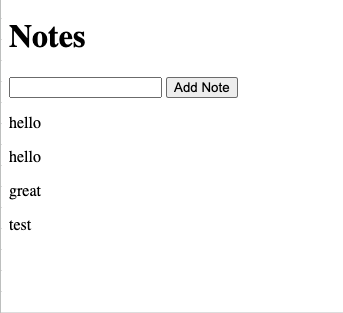

# GLB Challenge

# System Engineering
- Create a self-hosted Kubernetes cluster (using Vagrant in VirtualBox VM or multiple VMs)
     + 1 Master and 2 Nodes
     +  Load to be distributed among Nodes only
- Install Prometheus and Grafana to a k8s cluster

# Coding
- Create a web application that will show Notes from a DB and let you add notes into the DB
- Dockerize the application. Application and DB should run on different pods.
- Use MySQL to run your DB, and set PV and PVC.

# Deployment
- Deploy your application and DB to your k8s cluster

# Monitoring
- Find a way to export metrics from application and DB to Prometheus and visualize them using Grafana dashboard

# Acceptance Criteria:
- VM, k8s cluster, your application, Prometheus and Grafana deployment/provisioning/configuration is automated (preferably Ansible)
- Make use of kubeadm to deploy and setup your cluster
- Make use of Namespaces, Secrets, ConfigMaps as you think you should.
- Solution should not require installation of any additional packages on host machine except VirtualBox and Vagrant
- Please provide a basic documentation on how-to connect to a cluster, access metrics etc.
- We should be able to launch the solution on any host machine under any operating system
- Solution should provide the user an IP to see Grafana dashboard (example on x.x.x.250:80)
- Application contains "sensitive" data, avoid using public registries.

# Notes:
- Make use of your personal git accounts to collaborate with your teammates
- I have uploaded an example web application to: https://github.com/bofus10/glb_challenge
- Example looking site


## Application Example
Simple python web app that displays notes taken from a DB and lets add more.

To test locally

```shell
#Make sure to have mysql client installed first

#Run a DB Locally (adjust parameters as needed)
docker run --name some-mysql -e MYSQL_ROOT_PASSWORD=abc123 -e MYSQL_DATABASE=notes -p 3306:3306 -d mysql:5.7

# Adjust parameters on app.py and run
pip3 install -r requirements.txt
python3 app.py

#Visit the app from browser
http://localhost:5000/
```